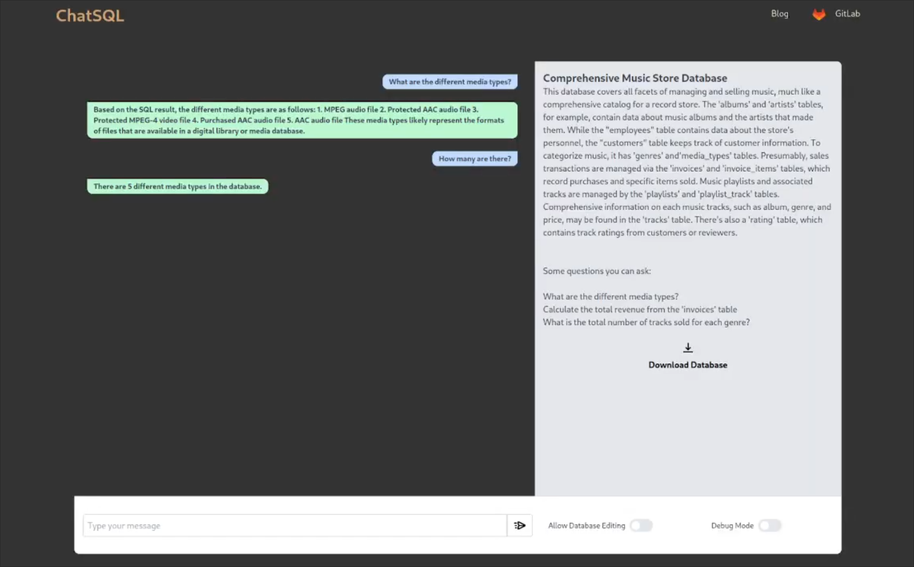

# 0. Table of contents

- [0. Table of Contents](#0-table-of-contents)
- [1. Introduction](#1-introduction)
  - [1.1 Overview](#11-overview)
  - [1.2 Glossary](#12-glossary)
- [2. System Architecture](#2-system-architecture)
  - [2.1 Filesystem](#21-filesystem)
  - [2.2 Flask Web Framework](#22-flask-web-framework)
	- [2.2.1 app.py](#221-appy)
	- [2.2.2 config.py](#222-configpy)
	- [2.2.3 database.py](#223-databasepy)
	- [2.2.4 routes.py](#224-routespy)
  - [2.3 OpenAI API Integration](#23-openai-api-integration)
  - [2.4 SQLite Database](#24-sqlite-database)
  - [2.5 LLM Layer: LangChain and Custom Chatbot Processor](#25-llm-layer-langchain-and-custom-chatbot-processor)
  - [2.6 Database Modification Prevention](#26-database-modification-prevention)
  - [2.7 Debug Mode](#27-debug-mode)
  - [2.8 Design Considerations](#28-design-considerations)
- [3. High-Level Design](#3-high-level-design)
  - [3.1 DFD System Model](#31-dfd-system-model)
	- [3.1.1 Key Components](#311-key-components)
  	- [3.1.1.1 User](#3111-user)
  	- [3.1.1.2 Web Interface](#3112-web-interface)
  	- [3.1.1.3 Flask Application](#3113-flask-application)
  	- [3.1.1.4 LLM Layer](#3114-llm-layer)
  	- [3.1.1.5 SQLite Database](#3115-sqlite-database)
	- [3.1.2 Data Flow Process](#312-data-flow-process)
- [4. Problems and Resolution](#4-problems-and-resolution)
  - [4.1 Prompt Testing and LLM Hallucination](#41-prompt-testing-and-llm-hallucination)
  - [4.2 GPT Version Issues](#42-gpt-version-issues)
- [5. Installation Guide](#5-installation-guide)
  - [5.1 Hardware and Software Requirements](#51-hardware-and-software-requirements)
  - [5.2 Installation Steps](#52-installation-steps)
- [6. References](#6-references)
- [7. Appendix](#7-appendix)
  - [7.1 Appendix A: LLM Hallucinations](#71-appendix-a-llm-hallucinations)
  - [7.2 Appendix B: Test Plan](#72-appendix-b-test-plan)

# 1. Introduction

## 1.1 Overview
⁤The ChatSQL project presents itself as a revolution to user interaction with databases. ⁤⁤Driven by the need to make database interactions easier for people with little to no IT literacy, ChatSQL is an approachable assistant that helps with natural language discussions about data and databases without requiring a lot of SQL understanding.

Underneath the hood of ChatSQL, lies a pivotal feature which is; the integration of OpenAI's API with the use of a powerful library, LangChain, to manage the LLM logic of the application which is crucial for translating natural language into SQL queries and converting SQL output back into natural language responses. This allows the project to leverage OpenAI's advanced natural language processing abilities to process and interpret user queries posed in a layman's language in addition to the context of the database to convert said query into a valid and executable SQL code.

The application is integrated within a Flask backend environment which facilitates easy access to the Chat Bot. Flask is a light and powerful web application framework for Python. It exceeds as a leading tool for developers based on its simplicity and flexibility. The central aspect of our application is a dynamic interaction mechanism where users can upload, query, and interact with databases through a conversational interface.

### Some core Flask functionality includes:

- uploading and downloading database files
- managing user sessions
- rendering HTML templates
- handling form data

The backend logic makes use of custom error handling, secure file processing, and conversation tracking via Flask sessions. The integration of SQLAlchemy allows the developers to update the sample databases with ease, along with some helper functions to edit this.

We utilise a modular architecture which is implemented using Flask's Blueprint system to organise and manage page routing, which provides for easy means of development, upkeep and scalability.

This document outlines the design and functionality of the Flask web application, from its configuration, database handling, Flask routes and the LLM access layer. Special emphasis is placed on the interaction between the Flask backend and the LLM layer, illustrating how the backend manages OpenAI queries and provides the user with a seamless and simple database querying method.

## 1.2 Glossary

Define and technical terms used in this document. Only include those with which the reader may not be familiar.

### General terminology:

- LLM: Large Language Model
- Prompt:
- SQL:
- SQL Query:
- `SELECT` SQL Query
- [LLM] hallucination:
- `"POST"` request:
- `"GET"` request:

### Libraries and terminology used in `chatbot.py`:
- LangChain\[1\]: A python library used for managing interactions with AI pipelines and memory.
- OpenAI API\[2\]: An API(Application Programming Interface) which allows users to utilise the OpenAI machine learning models.
- LLMChain: LangChain component for handling LLM interactions.
- ConversationBufferWindowMemory: A memory handling component in LangChain for storing and handling conversation history.
- HumanMessagePromptTemplate: A template to construct messages in Langchain prompts.
- ChatPromptTemplate: LangChain template tool for creating prompts.
- sqlite3: Python library for interacting with SQLite databases.
- re: Python regex module for handling and formatting expressions.
- dotenv: Python library for loading environment variables from a file.
### Flask terminology

- Flask\[3\]: A python-based web application framework.
- Blueprint: Flask feature which helps in organising a Flask application into components. Each Blueprint represents a set of operations/functionality.
- Session: Feature that allows storage of information specific to a user throughout the user's interactions. This is implemented on top of cookies.
- Route: A URL pattern in Flask applications which manages routing a specific function based on the URL.
- Jinja2 Template Rendering: templating language to dynamically build HTML files.
- SQLAlchemy\[4\]: An SQL toolkit and Object-Relational Mapping (ORM) library for Python.
- Flask-SQLAlchemy: An extension for Flask that adds support for SQLAlchemy with use of helpers and useful defaults.
- Werkzeug: Comprehensive WSGI application library. Used as a basis for Flask.
- `app.config`: A dictionary-like object to store the configuration variables of the application.

# 2. System Architecture
The System Architecture is made up of a number of modules which seamlessly blend together to create ChatSQL.

The system architecture of the Flask web application is designed to be a robust and user-friendly chatbot experience with the integration NLP and database query capabilities. The architecture is modular, ensuring separation of features/modules and easy maintainability. Key components of the system include the Flask web framework and the OpenAI API for the LLM functionality of language processing, and SQLite for database management. This architecture brief demonstrates the actual design components of the system as implemented and demonstrated.

## 2.1 Filesystem:
```shell
code/
├── FlaskProto
│   ├── app.py
│   ├── chatbot.py
│   ├── chat_history.json
│   ├── config.py
│   ├── database.py
│   ├── db-descriptions
│   │   ├── sampleDB-1.html
│   │   ├── sampleDB-2.html
│   │   ├── sampleDB-3.html
│   │   └── sampleDB-4.html
│   ├── db_sample
│   │   ├── sample_1.sqlite3
│   │   ├── sample_2.sqlite3
│   │   ├── sample_3.sqlite3
│   │   └── sample_4.db
│   ├── db_uploads
│   │   └── # user uploaded database files
│   ├── instance
│   │   └── sample_databases.db
│   ├── requirements.txt
│   ├── routes.py
│   ├── static
│   │   └── images
│   │   	├── cube.svg
│   │   	├── hero.webp
│   │   	├── indent.svg
│   │   	└── trans.svg
│   └── templates
│   	├── base.html
│   	├── chat.html
│   	├── index.html
|   	└── upload-db.html
```

## 2.2 Flask Web Framework:
At the heart of the system is the Flask web application framework, this serves as the backbone for handling HTTP requests & responses. Flask routes are defined within a Blueprint. Flask routes manage the web application's various endpoints such as:
- Homepage
- Database upload functionality
- Sample Database loading
Flask's templating engine can render HTML templates for the user interface by dynamically controlling the content to be rendered as well as building out the website from different modules stored as HTML files.

Flask's powerful built-in session management tools are ideal for storing and handling user input, as well as disposing of user data when it is no longer in use.

### 2.2.1 app.py
The `app.py` file is used to load the config from `config.py` and run the Flask web application via the `app.run(debug=True)` line in the main function. This starts the web application on local address `http://127.0.0.1:5000`/`http://localhost:5000` which can be accessed from a Browser from the same device that is locally running `app.py`.

Additionally some helper functions are included which are run from the terminal. These functions are intended to be used during development or as part of setting up the sample databases. They are used to configure and initialise the sample databases in a database model defined in `database.py`.
- Used to initialise the server's database:
> ```python
> @app.cli.command('init-db')
> ```
- Used to populate the server's database:
> ```python
> @app.cli.command('populate-db')
> ```

### 2.2.2 config.py
`config.py` is used to configure flask variables like folder locations, session and SQLAlchemy databases.

### 2.2.3 database.py
`class SampleDatabase(db.Model):` class is defined here which dictates the database model to be used to save and handle the sample databases. It adds columns for id, name, description_path, and database path.

### 2.2.4 routes.py
`routes.py` is used to define the routes as a blueprint which is then imported into the `app.py` file. This file incorporates routing for:
- homepage
- sample-db selection
- uploading database
- downloading database
- chat screen

## 2.3 OpenAI API Integration
Utilisation of the third-party OpenAI API allows the chatbot to handle NLP and LLM logic. The OpenAI API utilises advanced models like GPT3.5 and GPT4.

The API is responsible for generating SQL queries from the user's questions and converting SQL query outputs back into a natural language response. LLM & NLP functionality is crucial for the chatbot to understand the context and respond to user queries in a conversational manner, making complex database interactions seamless and non-technical from the user's perspective.

## 2.4 SQLite Database
SQLite allows us to manage internal and external database storage and retrieval. The LLM Layer accesses SQLite databases to fetch schema information, execute LLM generated SQL queries, and retrieve data. This component is vital for dynamic interaction with various databases allowing for universal interaction with any SQLite database.

## 2.5 LLM Layer: LangChain and Custom Chatbot Processor
Our custom `ChatbotProcessor` class is built on top of the LangChain library, which allows us to implement the required logic of querying a database with a simple natural language question and generating a natural language response.

### 2.5.1 `get_database_schema(self)`
- generate a database schema using `self.db_path` which generates an overview of the database with the data type, as well as sample data from the first row of the database.
### 2.5.2 `execute_sql_query(self, sql_query)`
- preprocess and execute the SQL query.
### 2.5.3 `generate_sql_query(self, question, history_messages, schema_already_sent, database_schema)`
- Using a LangChain `LLMchain` and constructing a curated prompt from the question, message history and database schema.
### 2.5.4 `generate_nlp _response(self, question, query_results, history_messages)`
- Generate a natural language response which will be shown to the user from the question, query results and message history.
### 2.5.5 `process_message(self, question)`
- Contains the main logic which ties the aforementioned functions together.
- It utilises a for loop which generates the SQL query and NLP response up to 6 times until a valid SQL query is formed and executed.
- Handles the database editing toggle to reject unintended database modifications.
- Handles OpenAI, SQL and Internal Errors with corresponding responses.
- Returns the bot's response and debug data.
### 2.5.6 `generate_sample_content(self)`
-  Generates Title, Description and Sample questions for user-uploaded databases.

## 2.6 Database Modification Prevention
In the ChatSQL system, a key feature is the prevention of accidental or database modification, such as unintended deletion or addition of data. This can sometimes happen as a result of the user's mistake or an LLM hallucination. This is achieved through the use of a boolean flag in the Flask application which is passed to the LLM layer.

The flask is a simple but effective control mechanism. Its default value is set to `False`, meaning the user must intentionally select the option to enable database modification via a toggle next to the chat window.

## 2.7 Debug Mode
The ChatSQL backend tracks and saves the user's questions as well as the corresponding chatbot's response, SQL query generated and SQL output. These details can be viewed by clicking a toggle button which showcases the SQL query and SQL output below each of the chatbot's messages.

This is intended for debugging internally while manually testing the application via the frontend website, additionally it is able to provide context to the end user if they wish to look at the corresponding SQL code which produced the answer.

# 3. High-Level Design
## 3.1 DFD System Model


The above Data Flow Diagram provides a high-level graphical view of the system's operational flow. IT visualises how data inputs are processed and converted into outputs that are processed and shown to the user.

### 3.1.1 Key Components
#### 3.1.1.1 User:
- starting point of data flow via user input.
- interacts with the Web interface via a Web Browser (ie; Google Chrome, Mozille Firefox, Microsoft Edge).
#### 3.1.1.2 Web Interface:
- User's primary interaction layer.
- Receives user inputs and processes them to the Flask backend via `"POST"` request.
#### 3.1.1.3 Flask Application:
- Handles the web application configuration and logic.
- Receives data from Web Interface.
- Communicates with the LLM Layer to process natural language input
#### 3.1.1.4 LLM Layer:
- Receives user input from Flask application along with additional database context.
- Preprocesses data between the different stages of the LLM Layer
- Uses curated prompts to generate SQL via OpenAI API query & a natural language response.
#### 3.1.1.5 SQLite Database:
- Processes SQL Queries sent by the LLM Layer
- Returns query results to the LLM Layer.

### 3.1.2 Data Flow Process
#### 3.1.2.1 **User Interaction**
- The user initialises the data flow by typing in a natural language query through the Web Interface.

#### 3.1.2.2 **POST Request**
- The Web Interface packs the data into a `"POST"` request and sends it to the Flask backend using the `/chat` route.
- Additional information like message history, and a boolean value ,`db_edit_allow`, is added to the `"POST"` request to dictate whether the user wants to allow SQL queries which can modify the database.

#### 3.1.2.3 **Processing & LLM Communication**
-  Once the Flask backend receives the question, it then initialises the flask session for the user which will save all communications for the duration of the conversation.
- The Flask backend then sends the database path and user's question to the LLM Layer using a `/chat ` `"POST"` request.

#### 3.1.2.4 **LLM Layer Processing**
- Once the LLM layer receives the input from the Flask application, it preprocesses the database by reading it and generating a database schema that can be placed in the curated prompt along with the user's question.
- The LLM Layer queries the OpenAI API with the curated LangChain prompt.

#### 3.1.2.5 **Database Query Execution**
- Upon receiving the SQL query from the OpenAI API, the LLM Layer utilises a function called `execute_sql_query()`
- `db_edit_allow` is passed here to allow database modification if the statement is not a `SELECT`  SQL statement.

#### 3.1.2.6 **Post-Processing and Return**
- As the final LLM step, the LLM later utilises another curated LangChain prompt to turn the SQL query output into a legible natural language answer.
- The final answer is returned to the Flask backend.

#### 3.1.2.7 **User Result**
- The final natural language answer is then rendered on the user's Web Interface, completing the data flow cycle.


# 4. Problems and Resolution
## 4.1 Prompt Testing and LLM Hallucination
Our original approach in testing consisted of the following filesystem:
```shell
test
├── chat_history.json
├── db_sample
│   ├── sample_1.sqlite3
│   ├── sample_2.sqlite3
│   ├── sample_3.sqlite3
│   └── sample_4.db
├── test1.db
├── test_ChatBotProcessor.py
├── test_data.json
├── test_query.py
└── tmp_createdb.py
```
The testing methodology of the prompt consisted of:
- parsing the `test_data.json` using the python `pytest` library, sample format below:
```json
{
	"database_path": "db_sample/sample_1.sqlite3",
	"tests": [
  	{
    	"question": "What was the biggest vaccination rate achieved?",
    	"expected_sql_result": "The result is: (99.4,)"
  	},
  	{
    	"question": "Where was the biggest vaccination rate achieved?",
    	"expected_sql_result": "The result is: ('Rathfarnham-Templeogue, South Dublin',)"
  	},
  	{
    	"question": "What are the different age groups listed in the database?",
    	"expected_sql_result": "The result is: ('5 - 11 years',), ('12 years and over',)"
  	},
  	{
    	"question": "How many records are there for a the month of June 2022?",
    	"expected_sql_result": "The result is: (1992,)"
  	}
	]
}
```
- We initialise an instance of and query using the `ChatbotProcessor` class.
- We loop through each question and execute the prompt.  
- `assert` is used to compare expected answers and test output.

In this configuration a major issue arises, due to the nature of LLMs, they can hallucinate as well as provide slightly different responses. While correct, these differences cause the resulting format to differ. It could be the case of not rounding to the nearest decimal or ordering the information in a different manner.
### 4.1.1 Resolving the issue
We had to run the `test_query.py` a number of times, this allowed us to approximate the questions which are causing issues and adjust the prompt and `generate_sql_schema` function appropriately.

Adjusting the temperature using LangChain proved useful, as with a temperature of `0.2` we were able to get more reproducible results. The temperature allows LLMs to add or decrease variety in the response. This lower temperature of `0.2`, in comparison the the default of `0.7` allows our chatbot to create easily reproducible results with the same prompts.

## 4.2 GPT version issues
During development we were using GPT-3.5, which provided good results while also being cost effective. As per our testing, GPT-3.5 approximately 2 out of 10 times runs out of tokens, so we knew we would switch to GPT-4 for better accuracy and token count.

Upon switching to GPT-4, we realised that the output differs in format, this was a simple fix. We added regex lines which extracted the SQL code from such cases.
However the reply from GPT-4 for the natural language query was lacklustre. GPT-4 in the case of some difficult questions hallucinated table names; e.g, the actual table is `"Age Group"` and GPT-4 outputs `"Age_Group"`. With the use of manual testing, we modified the prompt to take into account the differences. This consisted of:
- Simplifying the prompt, GPT-4 does not like long prompts as this makes it hallucinate.
- Laying out the formatting in a step-by-step format with clearer instructions.

In addition to these changes, we simplified the Database Schema structure which is generated by `generate_sql_query()`. We removed unnecessary formatting and enclosed the table/column names in quotation marks `" "`.

# 5. Installation Guide
## 5.1 Hardware and software requirements:
### 5.1.1 Hardware Requirements:
	- Computer with internet access
	- minimum 10GB free space

### 5.1.2 Software Requirements:
	- Modern Web Browser (e.g., Google Chrome, Mozilla Firefox, Safari)
	- Operating System: Windows 10, MacOS X, or a recent Linux distribution (e.g., Ubuntu 20.04).
	- Python: Version 3.7 or newer.
	- Pip: Python package manager, usually installed with Python.
	- SQLite: Comes pre-installed with Python.
	- Git: For cloning the repository (optional).
    
## 5.2 Installation Steps:
### 5.2.2 Install Python and Pip
- Download and install Python from [python.org](python.org).
- Ensure that pip is installed by running:
`python -m pip --version`
### 5.2.3 Clone or Download the Application Repository:
- if using Git, clone the repository using `git clone https://gitlab.computing.dcu.ie/choac2/2024-ca326-cchoa-3yp`
- Navigate to the `code` directory in the cloned repository.
### 5.2.4 Environment Setup
- Set up environment variables with `.env` where the OpenAI key is placed in the format:
`OPEN_AI_APIKEY = sk_XXX`
- Run the Makefile with `make` and/or `make run`, this will set up a new virtual environment and install all packages from `requirements.txt`
- Alternatively this can be done manually using `pip install -r requirements.txt`
### 5.2.5  Initialize the Database
- This step is only applicable if there doesn't exist a database in `code/FlaskProto/instance/sample_databases.db`
- in the terminal run the two commands:
```shell
flask init-db
```
> to initialise the database
```shell
flask populate-db
```
> to populate the database with data
- This database holds the information about the sample databases such as; title, description_path, db_path
### 5.2.6 Run the Flask Application
- Start the flask application by running `python app.py` from the `code/FlaskProto` directory
### 5.2.7 Verify Installation
-  Open a web browser in a new tab and navigate to the URL provided in the terminal by the Flask application, usually `http://127.0.0.1:5000` or `http://localhost:5000`
- Ensure that you have no applications running on the same URL, the Flask application will not work if you have other applications being hosted on this URL.

# 6. References

\[1\]LangChain: [https://www.langchain.com/](https://www.langchain.com/)
\[2\]OpenAI API: [https://openai.com/blog/openai-api](https://openai.com/blog/openai-api)
\[3\]Flask: [https://flask.palletsprojects.com/en/3.0.x/](https://flask.palletsprojects.com/en/3.0.x/)

# 7 Appendix
## 7.1 A: LLM Hallucinations
Hallucination in LLMs is an intricate and important problem, it referes to a model's generation of incorrect or nonsensical information. Such LLM hallucinations are not a result of error in the form of incorrect user input, hallucinations in LLMs represent a broader issue. This issue extends to include inaccuracies concerning general world knowledge. This means an LLM can "hallucinate" by giving false or illogical information that does not align with established logical reasoning or facts. [4]

In testing of our implementation we came acrosss such hallucinations in the Covid Vaccinations Database. Below is an example of a prompt and subsequent response:
```txt
User: What is the total number of vaccinations recorded in a particular local electoral area?
Bot: The result is: (1875.9,)
```

The above interaction consists of a User question taken from `test_data.json` and the Bot's response. The question was ambiguous and asked for a "particular local electoral area", yet no local electoral area was supplied. 

The correct answer would have been an error and refusal to answer as no local electoral area was supplied, instead on each test run a different answer was given. 

## 7.2 B: Testing
To make sure our main features are always functional, we use the pytest testing framework for our test suite. Among our tests are: 

- Pre-processing Function Testing: We velidate the pre-processing functions, such as database schema generation and error exception handling, that are needed for our chatbot. We prepare a sample database, by asserting the generated database schema matches our expected result, and testing the ability raise an error for non-existing databases, we are able to achieve our goal of this testing.

- Data Correctness Testing: We created a set of questions and expected response for our chatbot to assess the correctness. By running pytest, we can quickly gather the data we needed to compare it to previous results to make minor adjustments to our chatbot temperature and prompt selection.

- Prompt Testing: We initialize the `ChatbotProcessor` class and generate responses to each of the questions in `test_data.json`, the LLM's output is then execute using the `execute_sql_query` function and asserted against a known valid response to each question.

This structured approach for our test suite ensure that our system's functionality are always valid and helps to identify and address any issues, including LLM hallucinations.
