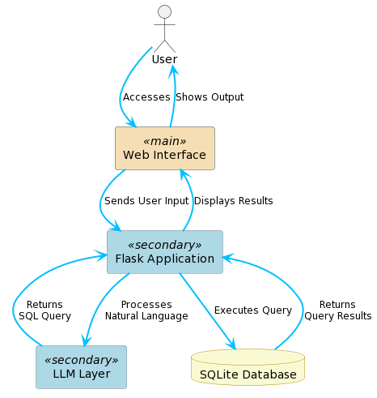

# 0. Table of contents

A table of contents with pages numbers indicated for all sections / headings should be included.

# 1. Introduction

## 1.1 Overview

`Provides a brief (half page) overview of the system / product that was developed. Include a description of how it works with other systems (if appropriate).`

⁤The ChatSQL project presents itself as a revolution to user interaction with databases. ⁤⁤Driven by the need to make database interactions easier for people with little to no IT literacy, ChatSQL is an approachable assistant that helps with natural language discussions about data and databases without requiring a lot of SQL understanding.

Underneath the hood of ChatSQL, lies a pivotal feature which is; the integration of OpenAI's API with the use of a powerful library, LangChain, to manage the LLM logic of the application which is crucial for translating natural language into SQL q ueries and converting SQL output back into natural language responses. This allows the project to leverage OpenAI's advanced natural language processing abilities to process and interpret user queries posed in a layman's language in addition to the context of the database to convert said query into a valid and executable SQL code.

The application is integrated within a Flask backend environment which facilitates easy access to the Chat Bot. Flask is a light and powerful web application framework for Python. It exceeds as a leading tool for developers based on it's simplicity and flexibility. The central aspect of out application is a dynamic interaction mechanism where users can upload, query, and interact with databases through a conversational interface.

### Some core Flask functionality includes:

- uploading and downloading database files
- managing user sessions
- rendering HTML templates
- handling form data

The backend logic makes use of custom error handling, secure file processing, and conversation tracking via Flask sessions. The integration of SQLAlchemy allows the developers to update the sample databases with ease, along with some helper functions to edit this.

We utilize a modular architecture which is implemented using Flask's Blueprint system to organize and manage page routing, which provides for easy means of development, upkeep and scalability.

This document outlines the design and functionality of the Flask web application, from its configuration, database handling, Flask routes and the LLM access layer. Special emphasis is placed on the interaction between the Flask backend and the LLM layer, illustrating how the backend manages OpenAI queries and provides the user with a seamless and simple database querying methods.

## 1.2 Glossary

Define and technical terms used in this document. Only include those with which the reader may not be familiar.

### General terminology:

- LLM: Large Language Model
- Prompt: 
- SQL: 
- SQL Query: 
- [LLM] hallucination: 
- `"POST"` request:
- `"GET"` request:

### Libraries and terminology used in `chatbot.py`:
- LangChain\[1\]: A python library used for managing interactions with AI pipelines and memory.
- OpenAI API\[2\]: An API(Application Programming Interface) which allows users to utilize the OpenAI machine learning models.
- LLMChain: LangChain component for handling LLM interactions.
- ConversationBufferWindowMemory: A memory handling component in LangChain for storing and handling conversation history.
- HumanMessagePromptTemplate: A template to construct messages in Langchain prompts.
- ChatPromptTemplate: LangChain template tool for creating prompts.
- sqlite3: Python library for interacting with SQLite databases.
- re: Python regex module for handling and formatting expressions.
- dotenv: Python library for loading environment variables from a file.
### Flask terminology

- Flask\[3\]: A python-based web application framework.
- Blueprint: Flask feature which helps in organizing a Flask application into components. Each Blueprint represents a set of operations/functionality.
- Session: Feature that allows storage of information specific to a user throughout the user's interactions. This is implemented on top of cookies.
- Route: A URL pattern in Flask applications whichi manages routing a specific function based on the URL.
- Jinja2 Template Rendering: templating language to dynamically build HTML files.
- SQLAlchemy\[4\]: An SQL toolkit and Opbect-Relational Mapping (ORM) library for Python.
- Flask-SQLAlchemy: An extension for Flask that adds support for SQLAlchemy with use of helpers and useful defaults.
- Werkzeug: Comprehensive WSGI application library. Used as a basis for Flask.
- `app.config`: A dictionary-like object to store the configuration variables of the application.

# 2. System Architecture

`This section describes the high-level overview of the system architecture showing the distribution functions across (potential) system modules. Architectural components that are reused or 3rd party should be highlighted. Unlike the architecture in the Functional Specification - this description must reflect the design components of the system as it is demonstrated.`


The System Architecture is made up of a number of modules which seamlessly blend together to create ChatSQL. 

The system architectire of the Flask web application is designed to be a robust and user-friendly chatbot experience with the integration NLP and database query capabilities. The architecture is modular, ensuring separation of features/modules and easy maintainability. Key components of the system include the Flask web framework and the OpenAI API for the LLM functionality of language processing, and SQLite for database management. This architecture brief demonstrates the actual design components of the system as implemented and demonstrated.

## 2.1 Filesystem:
```shell
code/
├── FlaskProto
│   ├── app.py
│   ├── chatbot.py
│   ├── chat_history.json
│   ├── config.py
│   ├── database.py
│   ├── db-descriptions
│   │   ├── sampleDB-1.html
│   │   ├── sampleDB-2.html
│   │   ├── sampleDB-3.html
│   │   └── sampleDB-4.html
│   ├── db_sample
│   │   ├── sample_1.sqlite3
│   │   ├── sample_2.sqlite3
│   │   ├── sample_3.sqlite3
│   │   └── sample_4.db
│   ├── db_uploads
│   │   └── # user uploaded database files
│   ├── instance
│   │   └── sample_databases.db
│   ├── requirements.txt
│   ├── routes.py
│   ├── static
│   │   └── images
│   │       ├── cube.svg
│   │       ├── hero.webp
│   │       ├── indent.svg
│   │       └── trans.svg
│   └── templates
│       ├── base.html
│       ├── chat.html
│       ├── index.html
|       └── upload-db.html
```

## 2.2 Flask Web Framework:
At the heart of the system is the Flask web application framework, this serves as the backbone for handling of HTTP requests & responses. Flask routes are defined within a Blueprint. Flask routes manage the web application's variouis endpoints such as:
- Homepage
- Database upload functionality
- Sample Database loading
Flask's templating engine can render HTML templates for the user interface by dynamically controlling the content to be rendered as well as building out the website from different modules stored as HTML files.

Flask's powerful built-in session management tools are ideal for storing and handling user input, as well as disposing of user data when it is no longer in use.

### 2.2.1 app.py
The `app.py` file is used to load the config from `config.py` and run the Flask web application via the `app.run(debug=True)` line in the main function. This starts the web application on local address `http://127.0.0.1:5000` which can be accessed from a Browser from the same device that is locally running `app.py`.

Additionally some helper functions are included which are run from the terminal. These functions are intended to be used during development or as part of setting up the sample databases. They are used to configure and initialize the sample databases in a database model defined in `database.py`.
- Used to initialize the server's database:
> ```python 
> @app.cli.command('init-db')
> ```
- Used to populate the server's database:
> ```python 
> @app.cli.command('populate-db')
> ```

### 2.2.2 config.py
`config.py` is used to configure flask variables like folder locations, session and SQLAlchemy databases.

### 2.2.3 database.py
`class SampleDatabase(db.Model):` class is defined here which dictates the database model to be used to save and handle the sample databases. It adds columns for id, name, description_path, and database path.

### 2.2.4 routes.py
`routes.py` is used to define the routes as a blueprint which is then imported into the `app.py` file. This file incorporates routing for:
- homepage
- sample-db selection
- uploading database
- downloading database
- chat screen

## 2.3 OpenAI API Integration
Utilization of the third-party OpenAI API allows the chatbot to handle NLP and LLM logic. The OpenAI API utilizes advanved models like GPT3.5 and GPT4. 

The API is responsible for generating SQL queries from the user's questions and converting SQL query outputs back into a natural language response. LLM & NLP functionality is crucial for the chatbot to understand the context and respond to user queries in a conversational manner, making complex database interactions seamless and non-technical from the user's perspective.

## 2.4 SQLite Database
SQLite allows us to manage internal and external database storage and retrieval. The LLM Layer accesses SQLite databases to fetch schema information, execute LLM generated SQL queries, and retrieve data. This component is vital for dynamic interaction with various databases allowing for universal interaction with any SQLite database.

## 2.5 LLM Layer: LangChain and Custom Chatbot Processor
Our custom `ChatbotProcessor` class is built on top of the LangChain library, which allows us to implement the required logic of querying a database with a simple natural language question and generating a natural language response.

## 2.6 Database Modification Prevention
In the ChatSQL system, a key feature is the prevention of accidental or database modification, such as unintended deletion or addition of data. This can sometimes happen as a result of the user's mistake or an LLM hallucination. This is achieved through the use of a boolean flag in the Flask application which is passed to the LLM layer. 

The flask is a simple but effective control mechanism. It's default value is set to `False`, meaning the user must intentionally select the option to enable database modification via a toggle next to the chat window.

## 2.7 Debug Mode
The ChatSQL backend tracks and saves the user's questions as well as the corresponding chatbot's response, SQL query generated and SQL output. These details can be viewed by clicking a toggle button which showcases the SQL query and SQL output below each of the chatbot's message. 

This is intended for debugging internally while manually testing the application via the frontend website, additionally it is able to provide context to the end user if they wish to look at the corresponding SQL code which produced the answer.

## 2.8 Design Considerations:
- Modularity: 
- Scalability: 
- Security: 
- User Experience


# 3. High-Level Design

`This section should set out the high-level design of the system. It should include system models showing the relationship between system components and the systems and its environment. These might be object-models, DFD, etc. Unlike the design in the Functional Specification - this description must reflect the design of the system as it is demonstrated.`

## 3.1 DFD System Model


The above Data Flow Diagram provides a high-level graphical view of the system's operational flow. IT visualizes how data inputs are processed and converted into outputs that are processed and shown to the user.

### 3.1.1 Key Components
#### 3.1.1.1 User:
- starting point of data flow via user input.
- interacts with the Web interface via a Web Browser (ie; Google Chrome, Mozille Firefox, Microsoft Edge).
#### 3.1.1.2 Web Interface:
- User's primary interaction layer.
- Receives user inputs and processes them to the Flask backend via `"POST"` request.
#### 3.1.1.3 Flask Application:
- Handles the web application configuration and logic.
- Receives data from Web Interface.
- Communicates with the LLM Layer to process natural language input
#### 3.1.1.4 LLM Layer:
- Receives user input from Flask application along with additional database context. 
- Preprocesses data between the different stages of the LLM Layer
- Uses curated prompts to generate SQL via OpenAI API query & a natural language response.
#### 3.1.1.5 SQLite Database:
- Processes SQL Queries sent by the LLM Layer
- Returns query results to the LLM Layer. 

### 3.1.2 Data Flow Process
#### 3.1.2.1 **User Interaction**
- The user initializes the data flow by typing in a natural language query through the Web Interface.

#### 3.1.2.2 **POST Request**
- The Web Interface packs the data into a `"POST"` request and sends it to the Flask backend using the `/chat` route.

#### 3.1.2.3 **Processing & LLM Communication**
-  Once the Flask backend receives the question, it then initializes the flask session for the user which will save all communications for the duration of the conversation.
- The Flask backend then sends the database path and user's question to the LLM Layer using a `/chat ` `"POST"` request.

#### 3.1.2.4 **LLM Layer Processing**
- Once the LLM layer receives the input from the Flask application, it preprocesses the database by reading it and generating a database schema that can be placed in the curated prompt along with the user's question.
- The LLM Layer queries the OpenAI API with the curated prompt.

#### 3.1.2.5 **Database Query Execution**
- Upon receiving the SQL query from the OpenAI API, the LLM Layer utilizes a function called `execute_sql_query()` 

#### 3.1.2.6 **Post-Processing and Return**

#### 3.1.2.7 **User Result**

## 3.2 

# 4. Problems and Resolution

`This section should include a description of any major problems encountered during the design and implementation of the system and the actions that were taken to resolve them.`

# 5. Installation Guide

`This is a 1 to 2 page section which contains a step by step software installation guide. It should include a detailed description of the steps necessary to install the software, a list of all required software, components, versions, hardware, etc.`

# 6. References

\[1\]
\[2\]
\[3\]
